# NexusAI — Agentic RAG Intelligence Platform

> **A production-grade, framework-free AI agent platform** featuring an autonomous ReAct loop, semantic document retrieval (RAG), a decorator-based tool registry, and a real-time Developer HUD dashboard. Built from scratch in native Python to demonstrate architectural mastery without the bloat of LangChain or LlamaIndex.

[](https://python.org)
[](https://fastapi.tiangolo.com)
[](https://www.trychroma.com)
[](https://docker.com)

---

## Architecture Overview

NexusAI decouples the UI, the API gateway, the agent coordinator, the vector search engine, and the model provider layer into modular, clean Python packages.

```mermaid
sequenceDiagram
    autonumber
    actor User
    participant HUD as Developer HUD UI
    participant API as FastAPI Server
    participant Router as LLM Router
    participant Agent as ReAct Loop Coordinator
    participant Store as Vector Store (ChromaDB)
    participant Tool as Tool Registry

    User->>HUD: Ask a question / Upload file
    HUD->>API: HTTP POST /api/chat (SSE Stream)
    API->>Agent: Run Agent Loop
    
    rect rgb(20, 30, 45)
        note over Agent, Router: Step 1: LLM Reasoning
        Agent->>Router: Format Prompt + History -> LLM
        Router->>Router: Active Provider Selection (Gemini/Ollama)
        Router-->>Agent: JSON Response: {"thought": "...", "action": "...", ...}
    end

    rect rgb(30, 20, 20)
        note over Agent, Tool: Step 2: Tool Execution
        Agent->>Agent: Parse Action Name & Arguments
        Agent->>Tool: Execute Tool (document_search, web_search, math)
        alt is Document Search
            Tool->>Store: Query Query Embeddings
            Store-->>Tool: Return Cosine Similarity Chunks
        end
        Tool-->>Agent: Observation result (Markdown text)
    end

    rect rgb(20, 40, 30)
        note over Agent, HUD: Step 3: Stream Updates
        Agent->>API: Yield AgentStep (thought, action, observation)
        API-->>HUD: SSE Stream Update
    end

    Agent->>Agent: Repeat loop until Action == 'None' (Answer synthesized)
    Agent-->>API: Yield Final Answer + inline source citations
    API-->>HUD: SSE Stream Complete
```



---

## Under the Hood: Key Engineering Systems

### 1. Manual ReAct Agent Loop (No Frameworks)
Standard frameworks (like LangChain) add layers of abstraction that obscure the raw prompt-and-parse cycle. NexusAI implements a **manual ReAct loop** (`backend/agents/assistant.py`):
*   **State Machine**: Maintains step count, token consumption, query latency, and history.
*   **Prompt Engineering**: Leverages a strict JSON-enforcing system prompt. The LLM must output exactly one of two structures:
    1.  *Action Mode*: `{"thought": "...", "action": "tool_name", "action_input": {...}}`
    2.  *Answer Mode*: `{"thought": "...", "answer": "..."}`
*   **Parser & Fail-safe**: Parses model outputs robustly. If the LLM wraps JSON inside Markdown code fences or includes prefix text, regular expression extractors fall back and salvage the JSON block. If parsing fails entirely, the agent treats the raw output as a direct answer.

### 2. RAG Pipeline & Embedding Benchmarks (`backend/rag/`)
NexusAI implements a document processing system that handles file ingestion, chunking, and similarity search:
*   **Recursive Semantic Splitter**: Breaks documents by logical boundaries (paragraphs first, then falling back to lines, sentences, and words) to ensure each chunk stays under the 512-character limit while retaining semantic cohesion. It enforces a 64-character overlap between adjacent chunks to maintain context continuity.
*   **Vector Database**: ChromaDB handles document storage, cosine similarity indexing, metadata filtering, and document deletions.
*   **Embedding Model Quantization Benchmark**:
    To optimize indexing and retrieval on local developer hardware, we benchmarked the default ChromaDB embedding model against the high-capacity `jina-embeddings-v5-small` model before and after applying **INT8 Dynamic Quantization**:

    | Model / Optimization | Parameters | Dimension | Latency (Corpus) | Latency (Per-Sentence) | Relative CPU Speed |
    |:---|---|---|---|---|---|
    | `all-MiniLM-L6-v2` (Default) | 22.7M | 384 | 254.0 ms | 50.8 ms | **37.0x** (Reference) |
    | `jina-embeddings-v5-small` (Base) | 677.0M | 1024 | 9,238.0 ms | 1,847.6 ms | **1.0x** |
    | `jina-embeddings-v5-small` (INT8 Quantized) | 677.0M | 1024 | **1,141.0 ms** | **228.2 ms** | **8.1x** |

    *Note: Quantization achieved an 8.1x speedup on CPU with minimal cosine similarity matching score degradation (relevance score shifted only from `0.79` to `0.73` for the same query corpus).*

### 3. Extensible Tool Registry Pattern (`backend/tools/`)
Instead of hardcoding tool matching logic, NexusAI uses a decorator-based tool registry (`backend/tools/__init__.py`):
*   **Decorator Registration**: Decorating any python function with `@registry.register(name, description, parameters)` registers it with the agent automatically.
*   **Type Safety**: Tool inputs are validated using Pydantic models.
*   **AST-Safe Math Evaluator**: The calculator tool uses Python's Abstract Syntax Tree (`ast`) module to evaluate expressions safely, allowing operators and math functions (like `sqrt`, `log`) while completely blocking unsafe statements (preventing shell injection attacks).
*   **HTML Scraper Search Tool**: Implements an HTML search scraper querying DuckDuckGo's browser endpoint, retrieving actual, high-quality snippets rather than relying on deprecated XML/JSON definition APIs.

### 4. Dynamic Provider Routing & Fallback (`backend/llm/`)
The LLM Provider layer abstracts provider-specific connection protocols, enabling hot-swapping:
*   **Ollama Client**: Hand-rolled, zero-dependency REST wrapper that directly streams response tokens from the local Ollama API.
*   **Gemini Client**: Connects via an OpenAI-compatible endpoint, leveraging the cloud-hosted Gemini models.
*   **Automatic Fallback Chain**: If the active local provider goes offline or encounters exceptions, the LLMRouter falls back automatically to the cloud provider to guarantee uptime.

### 5. Developer HUD & Streaming UI (`frontend/`)
The frontend is a vanilla HTML/CSS/JS single-page dashboard designed as a high-fidelity developer terminal:
*   **SSE readable streams**: Because the standard HTML5 `EventSource` API is restricted to `GET` requests, the frontend implements a custom fetch reader that streams `POST` request bodies chunk-by-chunk using `ReadableStream`.
*   **Split-Pane Telemetry HUD**:
    *   *Left Pane*: Knowledge base file manager with drag-and-drop document upload and deletion capability.
    *   *Right Pane*: The execution trace panel, showing live logs of the ReAct cycle (Thought, Tool Call, Observation, Answer) with microsecond latency meters.
    *   *Header/Footer*: Real-time status indicators showing model availability, query count, tokens consumed, and average response latency.

---

## Directory Structure

```
nexusai/
├── backend/
│   ├── agents/
│   │   └── assistant.py         # Manual ReAct execution loop (no frameworks)
│   ├── llm/
│   │   ├── base.py              # Abstract LLM provider interface
│   │   ├── ollama.py            # Local inference via Ollama REST API
│   │   ├── gemini.py            # Cloud inference via Gemini OpenAI-compat API
│   │   └── router.py            # Provider selection + auto-fallback logic
│   ├── rag/
│   │   ├── processor.py         # PDF/text parsing + recursive text chunking
│   │   └── vector_store.py      # ChromaDB collection management + cosine search
│   ├── tools/
│   │   ├── __init__.py          # Decorator-based tool registry
│   │   ├── math_tool.py         # AST-safe mathematical evaluator
│   │   └── search.py            # DuckDuckGo HTML search scraper
│   ├── main.py                  # FastAPI server with SSE streaming endpoints
│   └── models.py                # Pydantic request/response schemas
├── frontend/
│   ├── index.html               # Split-pane Developer HUD layout
│   ├── style.css                # Dark terminal aesthetic design system
│   └── app.js                   # Vanilla JS — SSE streaming, drag-drop upload
├── docker-compose.yml           # Container orchestration with health checks
├── Dockerfile                   # Python 3.12 slim image
├── run.sh                       # Local development startup script
└── requirements.txt             # Zero AI-framework dependencies
```

---

## Getting Started

### Local Setup

1.  **Clone the Repository**:
    ```bash
    git clone https://github.com/YOUR_USERNAME/nexusai.git
    cd nexusai
    ```

2.  **Configure Environment**:
    Create a `.env` file based on `.env.example`:
    ```ini
    GEMINI_API_KEY=AIzaSy...              # Google Gemini API key
    OLLAMA_BASE_URL=http://localhost:11434 # Local Ollama REST API URL
    OLLAMA_MODEL=qwen2.5:0.5b              # Model family for local CPU use
    GEMINI_MODEL=gemini-3.1-flash-lite    # Model family for cloud use
    ```

3.  **Run Development Server**:
    The startup script handles virtual environment creation, dependencies, health checks, and server launch automatically:
    ```bash
    chmod +x run.sh
    ./run.sh
    ```
    Once running, open **`http://localhost:8000`** in your browser.

### Docker Setup

Deploy the backend using Docker Compose:
```bash
docker compose up --build
```

---

## API Documentation

| Endpoint | Method | Payload / Params | Response | Description |
|:---|:---|:---|:---|:---|
| `/api/chat` | POST | `ChatRequest` (JSON) | SSE Stream | Agent chat with real-time Thought/Action stream |
| `/api/documents/upload` | POST | Form File | `DocumentUploadResponse` | Ingests, chunks, and indexes a file into ChromaDB |
| `/api/documents` | GET | None | `list[DocumentInfo]` | Returns all currently indexed files |
| `/api/documents/{id}` | DELETE | Path Variable | `{"status": "deleted"}` | Deletes a document and its chunks from ChromaDB |
| `/api/models` | GET | None | `list[ModelInfo]` | Lists LLM providers with availability and active status |
| `/api/models/select` | POST | `?provider=ollama/gemini` | `{"status": "switched"}` | Hot-swaps the active LLM provider |
| `/api/health` | GET | None | `HealthResponse` | Verifies providers, vector store, and system status |
| `/api/metrics` | GET | None | `MetricsResponse` | Returns query count, tokens, latency, and uptime |

---

## Architectural Trade-offs & Decisions

1.  **No Frameworks (Maintainability & Control)**: While frameworks like LangChain accelerate early prototyping, they insert deep nesting, brittle API signatures, and heavy dependency footprints. Writing native loops ensures the system is completely transparent, debuggable, and extensible without updates to third-party packages.
2.  **SSE ReadableStream vs. EventSource**: Standard browser `EventSource` does not support custom headers or body payloads in `POST` requests. We bypassed this by utilizing `fetch()` and consuming the response body stream directly using `ReadableStream.getReader()`, preserving the capability to send custom JSON chat payloads.
3.  **CPU-Optimized Embeddings**: Using high-dimensional cloud embeddings forces network roundtrips. By dynamic quantizing models locally or using lightweight local encoders (MiniLM), we ensure indexing operates entirely on local CPU resources with minimal query latency.
4.  **Security boundaries for Tool Execution**: Running code dynamically on servers is a primary attack vector. We restricted math evaluations to a parsing compiler (`ast`) that rejects all node types containing function declarations or execution calls except for mathematical nodes.

---

## License

MIT
