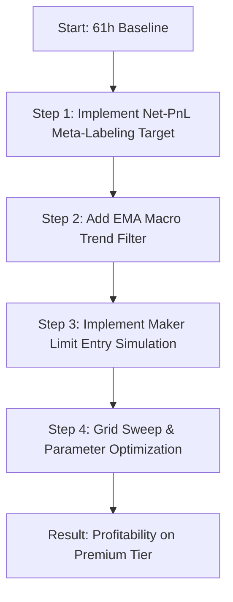

# Microstructure Scalping: Profitability Analysis & Brainstorming

This document analyzes the performance of the Lighter Order Book Imbalance (OBI) Scalper over the 61-hour extended dataset and outlines a research plan to transition the strategy from a capital-preservation state to consistent profitability.

---

## 1. Root Cause Analysis: Why is the Strategy Losing?

### A. The Fee & Slippage Drag (Taker Entries)
The current backtesting model assumes **Taker Market Order Entries** at a delayed timestamp ($t_{close} + \text{latency}$):
- **Standard Tier**: $0.00\%$ fees, but $300\text{ ms}$ execution latency.
- **Premium Tier**: $2.8\text{ bps}$ ($0.028\%$) taker fee, and $140\text{ ms}$ execution latency.

Under both tiers, entering as a taker crossings the spread. This means we suffer:
1. **Half-Spread Slippage**: Paying $S/2$ (the difference between the mid-price and the best ask/bid).
2. **Latency slippage**: Stale prices or unfavorable fills due to execution delays.
3. **Taker Fee**: $2.8\text{ bps}$ per entry, and another $2.8\text{ bps}$ on stop-losses or time-exits.

Let's calculate the transaction cost friction per round-trip trade under the Premium Tier:
$$\text{Friction (PT Exit)} = \text{Taker Entry Fee (2.8 bps)} + \text{Maker Exit Fee (0.4 bps)} + \text{Entry Slippage} \approx 4.2 \text{ bps}$$
$$\text{Friction (SL/Time Exit)} = \text{Taker Entry Fee (2.8 bps)} + \text{Taker Exit Fee (2.8 bps)} + 2 \times \text{Slippage} \approx 7.6 \text{ bps}$$

Considering that volume-bar volatility typically ranges from **10 to 25 bps**, a friction of $7.6\text{ bps}$ consumes **30% to 76%** of the gross return. This explains the deep baseline drawdown on the Premium Tier (e.g. BTC baseline lost $-22.27\%$).

### B. Counter-Trend Signal Decay (Regime Bias)
During this 61-hour backtest window, the market experienced a steady downtrend:
- ETH: **-4.14%**
- BTC: **-2.01%**
- SOL: **-2.70%**

The baseline strategy generates signals purely on the z-score of OBI (`cofi_z`). If OBI is high (imbalance on the buy side), it goes long. In a strong downtrend:
- A high OBI signal is often a minor pullback in a larger down-wave.
- Buying into this pullback results in immediate stop-outs as the macro trend resumes.
- The backtester lacks a macro trend filter to block counter-trend signals.

---

## 2. Brainstormed Solutions for Profitability

### Idea 1: Passive Execution (Maker Entries)
Instead of entering via taker market orders, the strategy should execute entries via **limit orders (maker)**:
1. **Spread Capture**: By placing a buy limit order at the best bid (or sell limit at best ask), we earn the spread instead of paying it.
2. **Fee Reduction**: Maker fee on the Premium Tier is $0.4\text{ bps}$ ($7\times$ cheaper than taker fee).
3. **Friction Reduction**: Round-trip cost drops dramatically:
   $$\text{Passive Round-Trip (PT Exit)} = \text{Maker Entry (0.4 bps)} + \text{Maker Exit (0.4 bps)} - \text{Spread Captured} \approx 0.8\text{ bps}$$

#### Backtesting Maker Fills:
To backtest maker entries:
- Place a limit order at the best bid at $t_{signal}$.
- The order is filled if subsequent trade prices touch or cross our limit price:
  $$P_{trade} \le P_{limit} \quad \text{(for Longs)}$$
  $$P_{trade} \ge P_{limit} \quad \text{(for Shorts)}$$
- If the order is not filled within $N$ bars, it is cancelled (unfilled signal).

---

### Idea 2: Macro Trend/Regime Filtering
Add a macro trend indicator to align the strategy with the prevailing market direction.
- **Implementation**: Compute an Exponential Moving Average (EMA) of the mid-price over a larger lookback (e.g., 100 volume bars).
- **Rules**:
  - Only execute **Long** entries if $\text{Price} > \text{EMA}_{100}$ (or if EMA slope is positive).
  - Only execute **Short** entries if $\text{Price} < \text{EMA}_{100}$ (or if EMA slope is negative).
- This will filter out high-risk counter-trend pullback trades and dramatically boost win rates during trending regimes.

---

### Idea 3: Net-PnL Meta-Labeling Target
Currently, the meta-labeler is trained on raw price hits:
$$\text{Label} = 1 \quad \text{if} \quad \text{exit\_type} == \text{"pt"}$$
$$\text{Label} = 0 \quad \text{if} \quad \text{exit\_type} == \text{"sl" or "time"}$$

However, if a trade hits its profit target but the return is eaten up by fees/slippage, it still has a negative net return. The model is currently learning to accept these unprofitable trades.
- **Solution**: Re-define the training label based on **Net Return after fees and slippage**:
  $$\text{Label} = 1 \quad \text{if} \quad \text{Net Return} > \epsilon$$
  $$\text{Label} = 0 \quad \text{if} \quad \text{Net Return} \le \epsilon$$
  Where $\epsilon \ge 0.5\text{ bps}$ is a minimum threshold to ensure the trade is truly profitable.

---

### Idea 4: Cross-Asset Lead-Lag Signals
In crypto, major assets (BTC and ETH) often act as leading indicators for altcoins (SOL).
- **Implementation**: Incorporate BTC and ETH bar returns, volatility, and OBI features directly into the feature matrix for SOL.
- **Signal**: If BTC OBI is strongly negative and BTC price starts dropping, SOL will likely drop shortly after. This cross-asset momentum is a classic high-frequency alpha source.

---

## 3. Concrete Action & Implementation Plan

To validate these brainstorming ideas, we will structure the next phase of research as follows:

### Action Items:
1. **Modify `run_lighter_pipeline_v4.py` / `lighter_backtester.py`**:
   - Change training labels from `label = 1 if exit_type == 'pt'` to `label = 1 if net_return > 0.0001`.
2. **Introduce Trend Indicator**:
   - Add `ema_trend` feature to the bar aggregation and filter signals.
3. **Simulate Maker Entries**:
   - Write a helper function in the backtester to model limit order fill probability based on subsequent trade executions.
